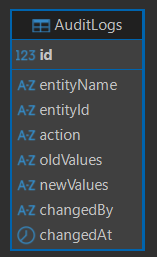
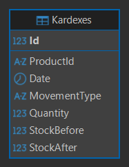
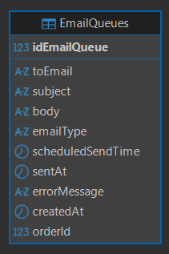
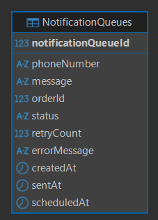
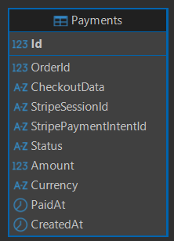
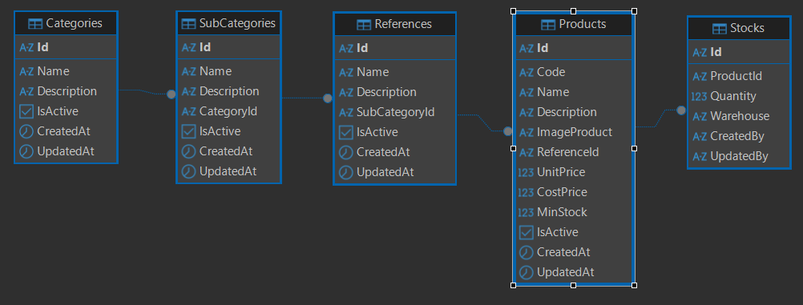
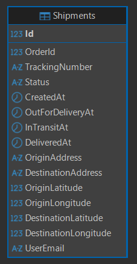
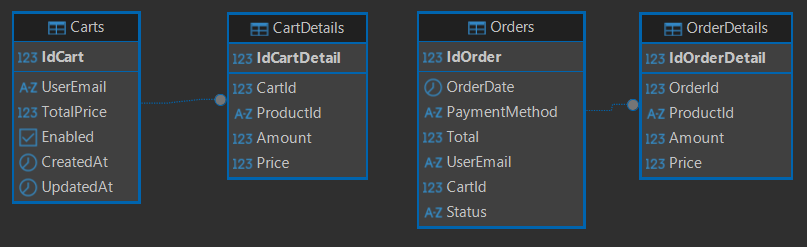
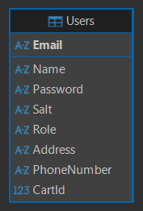

# TotalChainEcommerceMicroServicesApiNode

Backend REST API for the TotalChain e-commerce platform with 9 independent microservices (Node.js/Express/TypeScript/Sequelize/PostgreSQL), Stripe payments, Brevo email, and OpenWA WhatsApp notifications.

## Microservices

| Port | Service | DB | Purpose |
|------|---------|-----|---------|
| 5001 | **UsersManagerMicroService** | `UsersManagerMS` | Auth (JWT), user CRUD |
| 5002 | **ProductsMicroService** | `ProductsMS` | Catalog: categories, subcategories, references, products, stocks, images |
| 5003 | **ShopingsMicroService** | `ShopingsMS` | Shopping cart (Cart, CartDetail) + Orders (Order, OrderDetail) |
| 5004 | **PaymentsMicroService** | `PaymentsMS` | Stripe Checkout Sessions |
| 5005 | **ShipmentsMicroService** | `ShipmentsMS` | Shipments with auto-simulation (time-based status) |
| 5006 | **KardexMicroService** | `KardexMS` | Inventory movements (entry/exit records) |
| 5007 | **AuditLogsMicroService** | `AuditLogsMS` | Audit trail for CRUD operations |
| 5008 | **MailsMicroService** | `MailsMS` | Email queue + Brevo worker (sends immediately) |
| 5009 | **MessagesMicroService** | `MessagesMS` | WhatsApp notification queue + OpenWA worker (every 15s) |

## Tech Stack

| Layer | Technology |
|-------|-----------|
| Runtime | Node.js 18+ |
| Language | TypeScript |
| Framework | Express.js |
| ORM | Sequelize v6 (`Model.init()` — no decorators) |
| Databases | PostgreSQL (one per microservice) |
| Auth | JWT (`jsonwebtoken`) + bcryptjs |
| Payments | Stripe Checkout Sessions |
| Email | Brevo API (via `sib-api-v3-sdk`) |
| WhatsApp | OpenWA (local gateway on port 2785) |
| API Docs | Swagger JSDoc + swagger-ui-express (per service) |

## Architecture

Each microservice follows the same layered structure:

```
src/
  api/
    routes/        → Express routes + Swagger JSDoc annotations
    controllers/   → Async handlers, call service layer
    middleware/     → authMiddleware, internalAuthMiddleware, errorHandler, rateLimiter
  core/
    config/        → database.ts, swagger.ts
    dtos/          → CreateXDTO, XDTO, ApiResponseDTO
    helpers/       → ResponseHelper, ApiResponse
  database/
    models/        → Sequelize models (Model.init(), setupAssociations)
    repositories/  → BaseRepository<T> + specific repos
    migrations/    → Sequelize migrations
    seeders/       → Seed data
  services/
    XxxService.ts          → Business logic, orchestrates repos + HTTP clients
    httpClients/           → Axios calls to other microservices
      HttpUtils.ts         → getAuthHeaders() with shared JWT_KEY
    interfaces/            → IService interfaces
```

## Inter-service Communication

HTTP synchronous via **axios** with the shared `JWT_KEY` as Bearer token:

```
UsersManager (5001) ──► Mails (5008), AuditLogs (5007)
Products (5002)      ──► Kardex (5006), AuditLogs (5007)
Shopings (5003)      ──► Products, UsersManager, Payments, Mails, Messages, AuditLogs
Payments (5004)      ──► Shopings, Mails, Messages, Shipments, UsersManager, AuditLogs
Shipments (5005)     ──► Shopings, Mails, AuditLogs
Kardex (5006)        ──► Products, AuditLogs
```

`internalAuthMiddleware` in every service accepts the raw `JWT_KEY` as Bearer for inter-service calls (no real JWT needed).

## Key Features

- **Stripe payment flow**: Create checkout session → user pays → Stripe redirects → confirm payment → create order → send email → create shipment → schedule WhatsApp delivery notifications
- **WhatsApp notifications**: 3 messages pre-scheduled at 0min/1min/2min after payment ("out for delivery", "in transit", "delivered")
- **Email notifications**: Order confirmation and shipment emails sent immediately via Brevo
- **Shipment auto-simulation**: Status auto-advances based on elapsed time since creation (< 1min → OutForDelivery, 1-2min → InTransit, > 2min → Delivered) with interpolated GPS position
- **Stock management**: Stock decremented on add-to-cart, incremented on remove-from-cart; low stock alerts via email
- **Kardex inventory tracking**: Every stock movement recorded with before/after quantities
- **Audit logging**: All CRUD operations logged to AuditLogsMS
- **Swagger docs**: `/api-docs` per microservice with JSDoc-generated specs
- **Rate limiting**: 100 req/min per IP per service

## Setup & Installation

### Prerequisites

- Node.js 18+
- PostgreSQL (local or remote)
- Stripe account (for payments)
- Brevo account (for email) — optional
- OpenWA Docker container (for WhatsApp) — optional

### Installation

```bash
# 1. Clone and install dependencies for all services
cd TotalChainEcommerceMicroServicesApiNode

# Install each service
for dir in *MicroService; do
  cd "$dir" && npm install && cd ..
done

# 2. Create all 9 PostgreSQL databases
node create-databases.js

# 3. Run migrations
for dir in *MicroService; do
  cd "$dir" && npm run migrate && cd ..
done

# 4. Seed data (UsersManager, Products, Shopings)
cd UsersManagerMicroService && npm run db:seed && cd ..
cd ProductsMicroService && npm run db:seed && cd ..
cd ShopingsMicroService && npm run db:seed && cd ..
```

### Configure Environment

Each microservice has its own `.env` file. Key shared variables:

| Variable | Description |
|----------|-------------|
| `JWT_KEY` | Shared secret for JWT and inter-service auth (default: `TotalChain@.net`) |
| `DB_HOST`, `DB_PORT`, `DB_USER`, `DB_PASSWORD` | Database connection (unique DB name per service) |
| `STRIPE_SECRET_KEY` | Stripe secret key (PaymentsMS) |
| `BREVO_API_KEY` | Brevo API key (MailsMS) |
| `OPENWA_BASE_URL`, `OPENWA_API_KEY`, `OPENWA_SESSION_ID` | WhatsApp gateway config (MessagesMS) |
| `MICROSERVICES_*_API` | URLs of other microservices for HTTP calls |

### Running

```bash
# Start all services in order (5001 → 5009)
./start-services.sh

# Or start individually
cd UsersManagerMicroService && npm run dev      # Hot reload
cd UsersManagerMicroService && npm start         # Production
```

### Frontend

The React frontend (Vite) runs alongside with per-prefix proxy to all 9 microservices:

```bash
cd TotalChainEcommerceMicroServicesReact
npm install
npm run dev    # Opens http://localhost:5173
```

Proxy routes: `/api/users`, `/api/products`, `/api/carts`, `/api/payments`, `/api/shipments`, `/api/kardex`, `/api/audit-logs`, `/api/mails`, `/api/messages`

## API Endpoints

### UsersManagerMS (5001)
| Method | Endpoint | Auth | Description |
|--------|----------|------|-------------|
| POST | `/api/auth/register` | Public | Register user |
| POST | `/api/auth/login` | Public | Login, returns JWT |
| GET | `/api/users` | Admin | List users |
| GET | `/api/users/email/:email` | Internal | Get user by email |
| GET | `/api/users/me` | User | Get current user profile |

### ProductsMS (5002)
| Method | Endpoint | Auth | Description |
|--------|----------|------|-------------|
| GET | `/api/products` | Public | List products (with stock, category, images) |
| GET | `/api/products/:id` | Public | Get product by ID |
| POST | `/api/products` | Admin | Create product |
| POST | `/api/stocks/reserve` | Internal | Reserve stock (add to cart) |
| POST | `/api/stocks/release` | Internal | Release stock (remove from cart) |
| GET | `/api/categories` | Public | List categories |

### ShopingsMS (5003)
| Method | Endpoint | Auth | Description |
|--------|----------|------|-------------|
| GET | `/api/carts/:email` | User | Get active cart |
| POST | `/api/cart-details` | User | Add item to cart |
| POST | `/api/cart-details/decrease` | User | Decrease item quantity |
| POST | `/api/cart-details/remove` | User | Remove item from cart |
| DELETE | `/api/carts` | User | Clear cart |
| POST | `/api/carts/checkout` | User | Create Stripe checkout session |
| POST | `/api/orders` | Internal | Create order (after payment) |
| GET | `/api/orders/:email` | User | Get user orders |
| PUT | `/api/orders/:id/status` | Internal | Update order status |

### PaymentsMS (5004)
| Method | Endpoint | Auth | Description |
|--------|----------|------|-------------|
| POST | `/api/payment/create-checkout-session` | Internal | Create Stripe session |
| GET | `/api/payment/success` | Public | Confirm payment (redirect from Stripe) |

### ShipmentsMS (5005)
| Method | Endpoint | Auth | Description |
|--------|----------|------|-------------|
| GET | `/api/shipments` | Admin | List all shipments |
| GET | `/api/shipments/my` | User | Get current user's shipments |
| POST | `/api/shipments` | Internal | Create shipment |
| PATCH | `/api/shipments/:id/status` | Admin | Update shipment status |

### Other services
- **KardexMS (5006)**: `GET /api/kardex`, `POST /api/kardex/exit`, `POST /api/kardex/entry`
- **AuditLogsMS (5007)**: `GET /api/audit-logs`
- **MailsMS (5008)**: `GET /api/mails`, `POST /api/mails`
- **MessagesMS (5009)**: `GET /api/messages`, `POST /api/messages`, `GET /api/messages/session-status`, `POST /api/messages/retry-failed`

All responses follow the format:
```json
{
  "success": true,
  "message": "Operation result",
  "data": { ... }
}
```

## Data Model

Each microservice has its own PostgreSQL database with these main entities:

**ProductsMS**: `Categories` → `Subcategories` → `References` → `Products` → `Stocks`, `ProductImages`
**ShopingsMS**: `Carts` → `CartDetails`, `Orders` → `OrderDetails`
**ShipmentsMS**: `Shipments`
**PaymentsMS**: `CheckoutData`
**KardexMS**: `KardexEntries`, `KardexExits`
**AuditLogsMS**: `AuditLogs`
**MailsMS**: `EmailQueue`
**MessagesMS**: `NotificationQueue`
**UsersManagerMS**: `Users`

## Background Workers

| Worker | Service | Interval | Purpose |
|--------|---------|----------|---------|
| EmailWorker | MailsMS (5008) | 5 min | Processes queued emails via Brevo (fallback — emails also sent immediately via `addToQueue`) |
| NotificationWorker | MessagesMS (5009) | 15s | Processes queued WhatsApp messages via OpenWA gateway |

## Shipment Simulation

Shipments auto-advance through statuses based on elapsed time since creation:

| Time | Status | GPS Position |
|------|--------|-------------|
| < 1 min | `OutForDelivery` | At origin |
| 1–2 min | `InTransit` | Interpolated along route |
| > 2 min | `Delivered` | At destination |

This is computed on-the-fly in every GET response — no database writes needed.

## Payment Flow

```
User clicks "Pay" → ShopingsMS calls PaymentsMS.createCheckoutSession()
  → Stripe Checkout page opens → User pays
  → Stripe redirects to PaymentsMS /success?session_id=...
  → PaymentsMS confirms session → calls ShopingsMS.createOrder()
  → ShopingsMS: creates order, sends HTML email, clears cart
  → PaymentsMS: creates shipment (ShipmentsMS), schedules WhatsApp notifications
  → WhatsApp messages sent at 0min/1min/2min delays
```

## Auth

| Middleware | Description |
|-----------|-------------|
| `authMiddleware` | Verifies Bearer JWT with `jwt.verify()`, sets `req.user` and `req.userEmail` |
| `adminMiddleware` | Requires `req.user.role === "Admin"` |
| `internalAuthMiddleware` | Accepts raw `JWT_KEY` as Bearer (for inter-service calls) or attempts `jwt.verify()` |

JWT payload: `{ email, role }`. Roles: `"Admin"`, `"User"`.

## Commands (per microservice)

| Command | Description |
|---------|-------------|
| `npm run dev` | Hot-reload dev server (ts-node-dev) |
| `npm start` | Production (ts-node) |
| `npm run build` | TypeScript compile |
| `npm run migrate` | Sequelize migrations |
| `npm run db:seed` | Sequelize seeders |

## Swagger Documentation

Each microservice exposes Swagger UI at `/api-docs`:
- `http://localhost:5001/api-docs` (UsersManager)
- `http://localhost:5002/api-docs` (Products)
- ... up to 5009

## Technical Decisions

- **Sequelize v6 Model.init()** — no decorators, for maximum compatibility
- **Stock management** — decremented at add-to-cart time (not at payment), to prevent overselling
- **`JWT_KEY` with `#`** — dotenv truncates at `#`, all services consistently use the truncated value `TotalChain@.net`
- **Kardex fire-and-forget** — audit logging is async so a failed log doesn't block the transaction
- **Email sent immediately** — `addToQueue()` sends via Brevo synchronously, worker is fallback
- **Shipment simulation** — time-based status progression for demo purposes, no external carrier integration

## Screenshots


## Database Relationship Diagram

<kbd>
  
</kbd>
<kbd>
  
</kbd>
<kbd>
  
</kbd>
<kbd>
  
</kbd>
<kbd>
  
</kbd>
<kbd>
  
</kbd>
<kbd>
  
</kbd>
<kbd>
  
</kbd>
<kbd>
  
</kbd>

[DeepWiki moraisLuismNet/TotalChainEcommerceMicroServicesApiNode](https://deepwiki.com/moraisLuismNet/TotalChainEcommerceMicroServicesApiNode)

